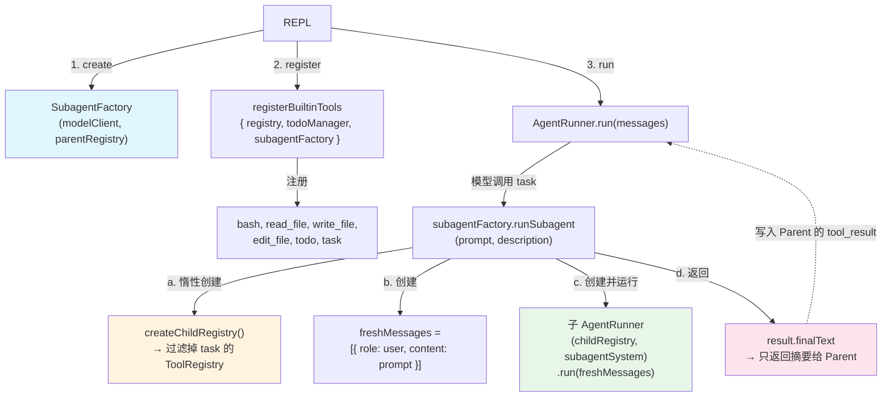
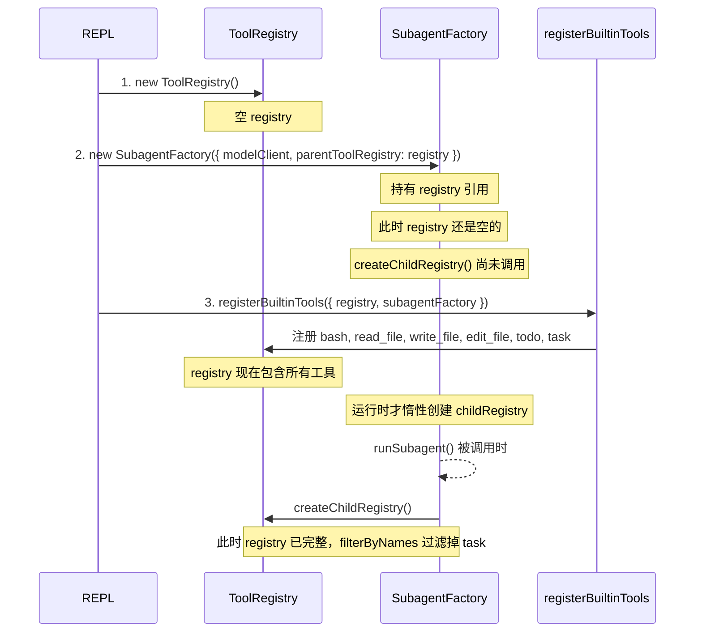

# s04 阶段开发文档：Subagent 子代理

## 1. 阶段目标

在保持 s01-s03 能力的前提下，实现 subagent（子代理）机制：

- Parent agent 拥有所有工具 + `task` 工具
- `task` 工具调用时 spawn 一个 child agent（fresh messages=[]）
- Child agent 拥有除 `task` 外的所有工具（禁止递归 spawning）
- Child 在自己的 context 中独立运行，最多 30 轮
- Child 运行完毕后只返回最终文本摘要给 parent
- Parent context 保持干净，child context 被丢弃

核心洞察："Process isolation gives context isolation for free."

## 2. 本阶段文档清单

- 开发文档：[s04-subagent-development.md](./s04-subagent-development.md)
- 接口文档：[s04-subagent-api-reference.md](./s04-subagent-api-reference.md)

## 3. 架构设计

### 3.1 文件变更清单

| 文件 | 操作 | 职责 |
|------|------|------|
| `src/core/types.ts` | 修改 | 新增 SubagentOptions、SubagentResult 类型 |
| `src/core/tool-registry.ts` | 修改 | 新增 filterByNames() 方法 |
| `src/core/subagent-factory.ts` | **新增** | 封装 Child agent 创建和运行逻辑 |
| `src/tools/builtin-tools.ts` | 修改 | 新增 task 工具注册 |
| `src/cli/repl.ts` | 修改 | 初始化 SubagentFactory 并传入 |
| `src/core/agent-runner.ts` | 不变 | SubagentFactory 内部复用 AgentRunner.run() |
| `src/core/todo-manager.ts` | 不变 | — |
| `src/tools/bash-tool.ts` | 不变 | — |
| `src/tools/file-tools.ts` | 不变 | — |
| `src/tools/path-policy.ts` | 不变 | — |

### 3.2 核心模块交互

### 3.3 初始化时序

**重要**：`createChildRegistry()` 应在 `runSubagent()` 调用时惰性创建，而非构造时创建，
因为构造时 registry 可能还未注册所有工具。

## 4. Story 拆分

### Story 1：ToolRegistry.filterByNames()

- 在 `tool-registry.ts` 新增 `filterByNames(whitelist: Set<string>): ToolRegistry`
- 不修改原 registry，返回新实例
- 添加单元测试

### Story 2：SubagentFactory 核心逻辑

- 新增 `src/core/subagent-factory.ts`
- 类型定义：`SubagentFactoryOptions`、`SubagentResult`
- 实现 `runSubagent(prompt, description?, maxTurns?)` 方法
- 惰性创建 childToolRegistry（过滤掉 "task"）
- 复用 `AgentRunner` 完成子循环

### Story 3：集成 task 工具到 builtin-tools

- 修改 `registerBuiltinTools` 签名：接受 options 对象（含可选 subagentFactory）
- 新增 task 工具注册
- 新增 `readOptionalString()` 辅助函数

### Story 4：REPL 集成与端到端验证

- 修改 `cli/repl.ts`：创建 SubagentFactory，更新 system prompt
- 更新提示符为 `s04 >>`
- 手动测试或集成测试

## 5. 与 Python 源码对齐检查

| Python 特性 | TypeScript 方案 |
|------------|----------------|
| `run_subagent(prompt)` fresh messages | `runSubagent()` 创建新数组 |
| CHILD_TOOLS 不含 task | `filterByNames` 过滤 |
| PARENT_TOOLS = CHILD_TOOLS + task | 条件注册 task |
| SUBAGENT_SYSTEM prompt | SubagentFactory.subagentSystemPrompt |
| Max 30 turns | maxTurns 默认 30 |
| 只返回最终文本 | `result.finalText` |
| Parent context 干净 | freshMessages 局部变量 |

## 6. 风险与缓解

| 风险 | 缓解 |
|------|------|
| 循环依赖：Factory 需要 registry，registry 需要 Factory 注册 task | 惰性创建 childRegistry |
| Child 递归调用 task | filterByNames 显式排除 |
| Child 抛出异常 | AgentRunner 内部 catch，返回错误文本 |
| 向后兼容 s03 | subagentFactory 参数可选 |
