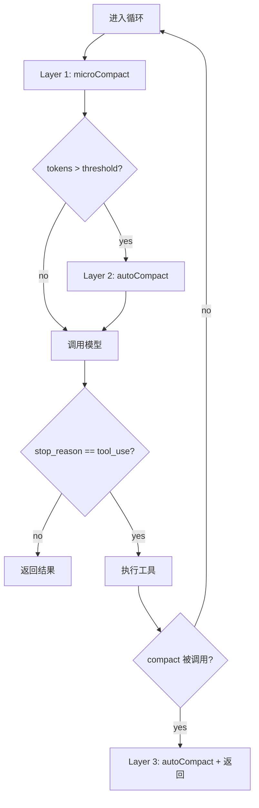

# s06: Context Compact API 参考

## Compactor

**文件**: `src/core/compactor.ts`

三层上下文压缩管线，使 agent 能在无限会话中持续工作。

### 构造函数

```typescript
constructor(options: CompactorOptions)
```

**CompactorOptions**:

```typescript
interface CompactorOptions {
  modelClient: ModelClient;     // 用于 auto_compact 时调用 LLM 生成摘要
  transcriptDir: string;        // transcript 保存目录的绝对路径
  threshold?: number;           // auto_compact 触发阈值，默认 50000
  keepRecent?: number;          // micro_compact 保留的最近 tool_result 数量，默认 3
  preserveTools?: Set<string>;  // 结果不被压缩的工具名集合，默认 {"read_file"}
}
```

- 构造时仅保存参数，不执行 I/O

---

### `estimateTokens(messages: AgentMessage[]): number`

粗略估算消息列表的 token 数（~4 字符 ≈ 1 token）。

**返回值格式**: 整数，表示估算的 token 数。

**计算方式**: `Math.floor(JSON.stringify(messages).length / 4)`

**输入/输出示例**:

```typescript
// 空消息列表
compactor.estimateTokens([])
// → 0

// 有内容的消息列表
compactor.estimateTokens([
  { role: "user", content: "hello" },
  { role: "assistant", content: [{ type: "text", text: "hi there" }] }
])
// → 约 10~15 (取决于 JSON 序列化后的字符数 / 4)
```

#### 所用 Node.js 方法

##### `JSON.stringify(value)`

- **作用**: 将 JavaScript 值序列化为 JSON 字符串
- **参数**: `value: any` — 要序列化的值
- **返回值**: `string` — JSON 字符串表示
- **举例场景**: 将整个消息列表转为字符串以计算字符数：`JSON.stringify(messages).length`

##### `String.prototype.length`

- **作用**: 返回字符串的字符数
- **参数**: 无（属性访问）
- **返回值**: `number` — 字符串长度
- **举例场景**: 获取序列化后消息列表的字符数：`JSON.stringify(messages).length`

##### `Math.floor(x)`

- **作用**: 向下取整
- **参数**: `x: number` — 要取整的数值
- **返回值**: `number` — 不大于 x 的最大整数
- **举例场景**: 将字符数除以 4 后取整：`Math.floor(charCount / 4)`

---

### `microCompact(messages: AgentMessage[]): void`

Layer 1: 微压缩。**就地修改**消息列表中旧的 tool_result 内容为占位符。

**替换规则**:
1. 收集所有 `tool_result` 类型的 part
2. 保留最近 `keepRecent`（默认 3）条不动
3. `read_file` 的结果永远不被替换（参考材料，压缩后需要重读）
4. 内容 ≤ 100 字符的不替换（太短无压缩价值）
5. 其余替换为 `"[Previous: used {tool_name}]"`

**替换后格式**:

```
[Previous: used bash]
[Previous: used write_file]
```

**输入/输出示例**:

```typescript
// 假设有 5 个 tool_result，keepRecent = 3
// 前 2 个（非 read_file、内容 > 100 字符）被替换
// messages[0].content[0] = { type: "tool_result", toolUseId: "xxx", content: "[Previous: used bash]" }
// messages[1].content[0] = { type: "tool_result", toolUseId: "yyy", content: "[Previous: used write_file]" }
// messages[2~4] 的 tool_result 保持原样
```

**无 tool_result 或数量 ≤ keepRecent 时**: 不做任何修改。

#### 所用 Node.js 方法

无额外 Node.js I/O 调用。仅遍历和修改内存中的消息数组。

---

### `autoCompact(messages: AgentMessage[]): Promise<AgentMessage[]>`

Layer 2/3: 完整压缩。保存 transcript 到磁盘，请求 LLM 生成摘要，返回压缩后的消息列表。

**执行步骤**:
1. 创建 `transcriptDir` 目录（如不存在）
2. 将所有消息序列化为 JSONL 写入 `{transcriptDir}/transcript_{timestamp}.jsonl`
3. 取对话文本末尾 80000 字符
4. 调用 `modelClient.createTurn()` 请求摘要
5. 返回单条 user 消息

**返回值格式**:

```typescript
[
  {
    role: "user",
    content: "[Conversation compressed. Transcript: /path/to/.transcripts/transcript_1713000000.jsonl]\n\n{摘要文本}"
  }
]
```

**LLM 无法生成摘要时**: content 中使用 `"No summary generated."` 作为回退。

**输入/输出示例**:

```typescript
// 成功
const compacted = await compactor.autoCompact(messages);
// → [
//     {
//       role: "user",
//       content: "[Conversation compressed. Transcript: /project/.transcripts/transcript_1713000000.jsonl]\n\n## Summary\n1. Created file X\n2. Fixed bug Y\n3. Current state: tests passing"
//     }
//   ]

// LLM 未返回文本
const compacted = await compactor.autoCompact(messages);
// → [
//     {
//       role: "user",
//       content: "[Conversation compressed. Transcript: /project/.transcripts/transcript_1713000000.jsonl]\n\nNo summary generated."
//     }
//   ]
```

#### 所用 Node.js 方法

##### `fs.mkdirSync(dir, options)`

- **作用**: 同步创建目录
- **参数**:
  - `dir: string` — 目录路径
  - `options: { recursive: boolean }` — `true` 表示如果父目录不存在则一并创建，目录已存在时不报错
- **返回值**: `string | undefined` — 创建的第一个目录路径
- **举例场景**: 创建 `.transcripts/` 目录：`fs.mkdirSync(transcriptDir, { recursive: true })`

##### `fs.writeFileSync(filePath, data)`

- **作用**: 同步将数据写入文件（覆盖已有文件）
- **参数**:
  - `filePath: string` — 文件路径
  - `data: string | Buffer` — 要写入的内容
- **返回值**: `void`
- **举例场景**: 写入 transcript JSONL 文件：`fs.writeFileSync(transcriptPath, lines)`

##### `path.join(...segments)`

- **作用**: 拼接路径片段，处理操作系统分隔符
- **参数**: `...segments: string[]` — 路径片段
- **返回值**: `string` — 拼接后的规范化路径
- **举例场景**: `path.join(transcriptDir, \`transcript_\${ts}.jsonl\`)` → `"/project/.transcripts/transcript_1713000000.jsonl"`

##### `Math.floor(x)`

- **作用**: 向下取整
- **参数**: `x: number` — 要取整的数值
- **返回值**: `number` — 不大于 x 的最大整数
- **举例场景**: 获取 Unix 时间戳：`Math.floor(Date.now() / 1000)`

##### `Date.now()`

- **作用**: 返回自 1970-01-01 00:00:00 UTC 以来的毫秒数
- **参数**: 无
- **返回值**: `number` — 毫秒级时间戳
- **举例场景**: 生成 transcript 文件名的时间戳部分：`Math.floor(Date.now() / 1000)` → `1713000000`

##### `JSON.stringify(value)`

- **作用**: 将 JavaScript 值序列化为 JSON 字符串
- **参数**: `value: any` — 要序列化的值
- **返回值**: `string` — JSON 字符串
- **举例场景**: 将消息列表序列化为文本用于摘要请求：`JSON.stringify(messages)`

##### `String.prototype.slice(start)`

- **作用**: 提取字符串的子串（负索引从末尾计数）
- **参数**: `start: number` — 起始索引（负值表示从末尾倒数）
- **返回值**: `string` — 提取的子串
- **举例场景**: 截取对话文本末尾 80000 字符：`conversationText.slice(-80000)`

##### `Array.prototype.map(fn)`

- **作用**: 对数组每个元素执行映射函数，返回新数组
- **参数**: `fn: (item, index) => result` — 映射函数
- **返回值**: `Array` — 映射后的新数组
- **举例场景**: 将消息列表转为 JSONL 行：`messages.map(m => JSON.stringify(m))`

##### `Array.prototype.join(separator)`

- **作用**: 将数组元素用分隔符连接为字符串
- **参数**: `separator: string` — 分隔符
- **返回值**: `string` — 连接后的字符串
- **举例场景**: 将 JSON 行用换行符连接：`lines.join("\n")`

---

## compact 工具

**名称**: `compact`
**描述**: Trigger manual conversation compression.

### Input Schema

```json
{
  "type": "object",
  "properties": {
    "focus": { "type": "string", "description": "What to preserve in the summary" }
  }
}
```

### 返回值

固定返回字符串 `"Compressing..."`。实际压缩由 AgentRunner 在检测到 compact 工具被调用后触发 `compactor.autoCompact()`。

### 输入/输出示例

```json
// input
{ "focus": "keep the database schema details" }

// output
"Compressing..."
```

#### 所用 Node.js 方法

无。handler 仅返回固定字符串。

---

## AgentRunner 变更

s06 的 AgentRunner 在 s05 基础上集成压缩管线：

### 构造函数新增参数

```typescript
interface AgentRunnerOptions {
  // ... s05 已有参数 ...
  compactor?: Compactor;  // s06: 可选，不传则不启用压缩
}
```

### 循环内变更

```typescript
async run(initialMessages: AgentMessage[]): Promise<AgentRunResult> {
  const messages = [...initialMessages];
  for (let turn = 0; turn < this.maxTurns; turn++) {
    // Layer 1: micro_compact (每轮)
    this.compactor?.microCompact(messages);

    // Layer 2: auto_compact (超阈值)
    if (this.compactor && this.compactor.estimateTokens(messages) > this.compactor.threshold) {
      const compacted = await this.compactor.autoCompact(messages);
      messages.length = 0;
      messages.push(...compacted);
    }

    // ... 调用模型 + 执行工具 ...

    // Layer 3: manual compact
    if (usedCompact && this.compactor) {
      const compacted = await this.compactor.autoCompact(messages);
      return { messages: compacted, finalText: "(context compacted)" };
    }
  }
}
```

### 流程图


