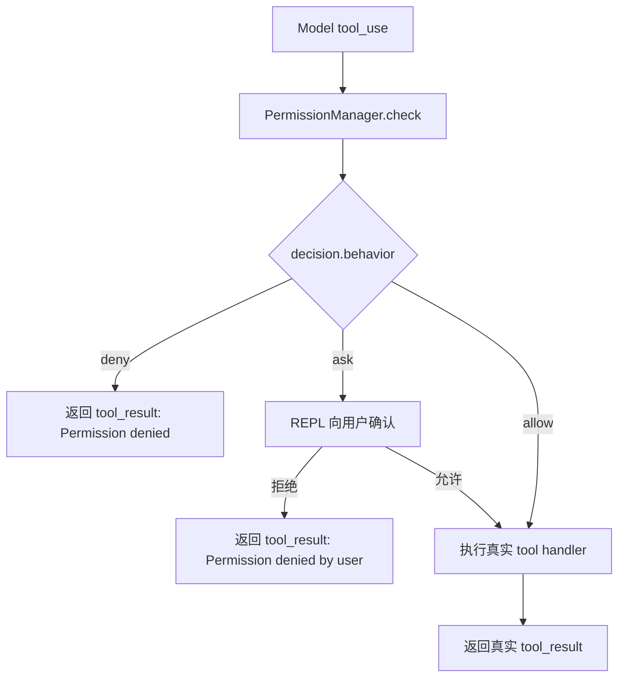
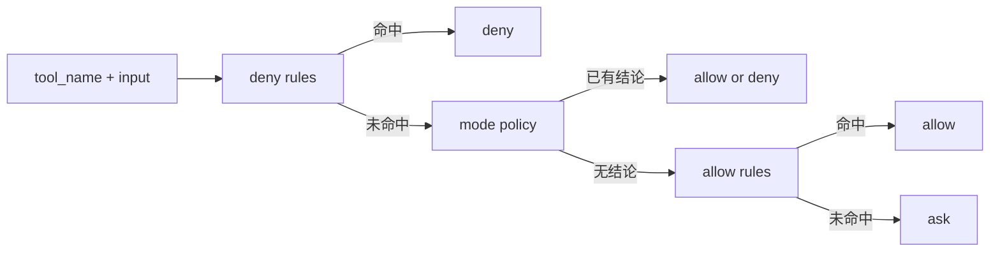
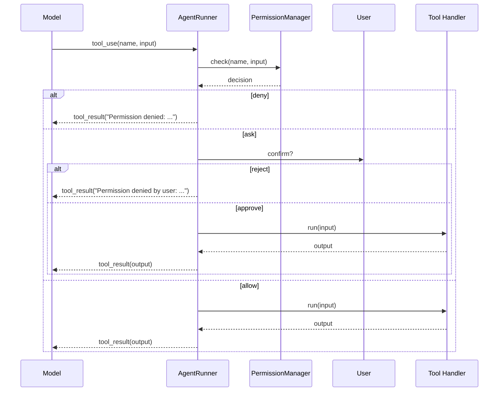

# s07 阶段开发文档：Permissions 权限系统

## 阶段目标

在保持 `s06` 主循环、技能、todo、压缩能力都继续可用的前提下，引入一条最小但清楚的权限管道：

- 模型先提出 `tool_use`
- 系统先做权限判断
- 只有被允许的调用才真正进入 tool handler

这一阶段的核心不是“新增更多工具”，而是：

**把“模型想执行什么”与“系统真的去执行什么”拆成两步。**

## 核心概念



最小权限系统只需要回答三件事：

1. 这次调用要不要直接拒绝
2. 这次调用能不能自动放行
3. 剩下的灰区要不要问用户

## 相对 s06 的变更

| 组件 | s06 | s07 |
| --- | --- | --- |
| 工具集合 | bash + file + todo + load_skill + compact | 工具集合不变 |
| 工具执行路径 | `tool_use -> handler` | `tool_use -> permission -> handler` |
| 新模块 | `Compactor` | `PermissionManager` |
| `AgentRunner` | 直接执行 tool handler | 先检查权限，再决定 deny / ask / allow |
| `REPL` | 仅负责读写用户输入 | 额外负责 `ask` 场景下的人类确认 |
| 提示符 | `s06 >>` | `s07 >>` |

## 这一阶段不要做的事

- 不提前做 `s08 Hook`
- 不提前做 `s09 Memory`
- 不把权限系统做成完整产品级 ACL 引擎
- 不在这一阶段引入复杂持久化权限配置

当前阶段只做完成主体功能所需的最小边界：

- 少量 deny rules
- 三种 mode
- 最小 ask-user 回路

## 推荐的最小权限模型

### 三种 mode

| mode | 语义 | 最小策略 |
| --- | --- | --- |
| `default` | 普通交互模式 | 读操作可自动过，其它灰区问用户 |
| `plan` | 计划 / 审查模式 | 禁止写文件和 bash 执行 |
| `auto` | 高流畅度探索模式 | 读操作自动过，已知危险直接拒绝，其余问用户 |

### 最小规则顺序



推荐先做这几类最小规则：

- `bash` 命令以 `sudo ` 开头时 `deny`
- `write_file` / `edit_file` 目标路径包含 `/.git/` 或以 `.git/` 开头时 `deny`
- `read_file`、`load_skill`、`todo`、`compact` 默认 `allow`

## 需要新建的文件

1. **`src/core/permission-manager.ts`**
   - 导出 `PermissionBehavior`
   - 导出 `PermissionMode`
   - 导出 `PermissionRule`
   - 导出 `PermissionDecision`
   - 实现 `PermissionManager.check(toolName, input)`
   - 内部实现最小 `matchesRule(rule, toolName, input)`

## 需要修改的文件

1. **`src/core/agent-runner.ts`**
   - 构造函数接受 `permissionManager`
   - 构造函数接受可选 `requestPermission`
   - `executeTool()` 中先跑 `permissionManager.check()`
   - `deny` 时直接返回权限拒绝的 `tool_result`
   - `ask` 时调用 `requestPermission`

2. **`src/cli/repl.ts`**
   - 创建 `PermissionManager`
   - 默认 mode 先用 `default`
   - 传入 `requestPermission` 回调
   - 提示符从 `s06` 更新为 `s07`

3. **`tests/repl-smoke.test.ts`**
   - 冒烟测试阶段提示从 `s06` 更新到 `s07`

## 推荐的返回文本约定

为保证模型能稳定理解权限结果，这一阶段建议固定使用下面三种返回文本：

### 1. 直接拒绝

```text
Permission denied: matched deny rule (bash content: sudo *)
```

### 2. 用户拒绝

```text
Permission denied by user: write_file requires confirmation
```

### 3. 用户允许后执行

不额外包装，直接返回真实工具结果，例如：

```text
Wrote /project/src/app.ts
```

## `AgentRunner` 中的最小接入方式



## 实现顺序

1. 实现 `src/core/permission-manager.ts`
2. 修改 `src/core/agent-runner.ts`，把权限检查接入 `executeTool()`
3. 修改 `src/cli/repl.ts`，补上最小确认回路和 `s07` 提示符
4. 更新 `tests/repl-smoke.test.ts`
5. 验收：`npm run build` + `npm test`

## 需要用到的 Node.js 方法

| 功能 | Node.js 方法 | 用途 |
| --- | --- | --- |
| 终端确认 | `readline.Interface.question()` | 在 `ask` 场景下询问用户是否允许执行 |
| 当前工作目录 | `process.cwd()` | 构造系统提示和默认执行上下文 |
| 标准输出 | `process.stdout.write()` | 输出权限确认提示和结果 |

## 阶段完成标准

满足下面条件，才算 `s07` 主体能力完成：

- 所有工具执行在进入 handler 前都先经过权限判断
- 至少支持 `default` / `plan` / `auto` 三种 mode
- 至少支持最小 deny / allow / ask 三分支
- REPL 中 `ask` 场景能真正等待用户确认
- `s06` 的 todo、skills、compact 不被错误移除

## 设计决策

- **不改工具集合**：`s07` 的重点是控制面，不是再加一层工具
- **权限先于 handler**：真正的边界必须在执行前，而不是执行后补解释
- **最小 ask 回路先放在 REPL**：当前阶段先把人与系统的确认链打通，不提前抽象成更复杂的 approval protocol
- **规则先做内存内常量**：后续若需要持久化，可放到 `s09` 或更后面的平台层统一处理
