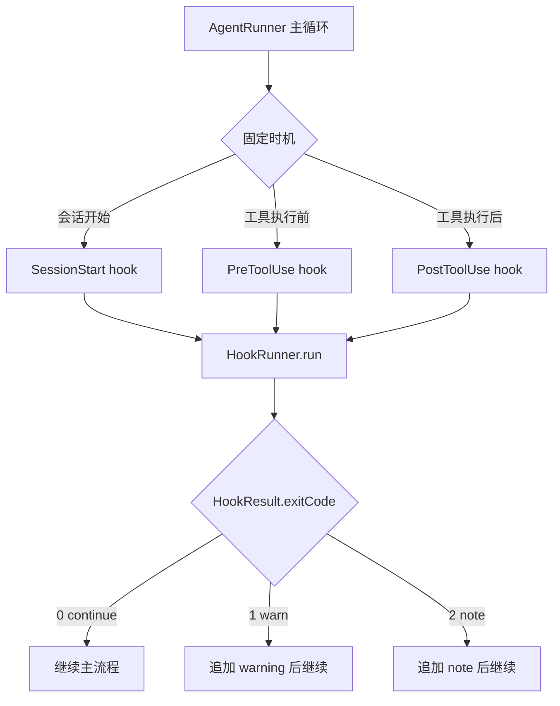
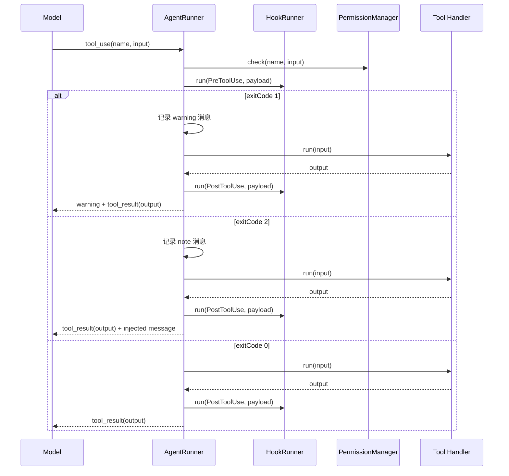

# s08 阶段开发文档：Hooks Hook 系统

## 阶段目标

在 `s07` 已经完成工具执行前权限判断的基础上，引入一条最小 Hook 管道：

- 主循环在固定时机发出事件
- `HookRunner` 统一调用该事件下注册的 handler
- handler 返回统一的 `HookResult`
- 主循环根据返回结果继续，或向模型补充 warning / note 消息

这一阶段的核心不是“继续加工具”，而是：

**让主循环暴露扩展时机，而不是让每个扩展需求都改写主循环。**

## 核心概念



最小 Hook 系统只需要回答三件事：

1. 当前发生了哪个事件
2. 这次事件要交给哪些 handler
3. handler 的结果如何影响主流程

## 相对 s07 的变更

| 组件          | s07                                 | s08                                                          |
| ------------- | ----------------------------------- | ------------------------------------------------------------ |
| 工具执行路径  | `tool_use -> permission -> handler` | `tool_use -> permission -> pre hook -> handler -> post hook` |
| 新模块        | `PermissionManager`                 | `HookRunner`                                                 |
| `AgentRunner` | 只认识权限检查                      | 额外在生命周期节点触发 hook                                  |
| `REPL`        | 负责启动会话和权限确认              | 额外可在 `SessionStart` 注入欢迎或说明                       |
| 提示符        | `s07 >>`                            | `s08 >>`                                                     |

## 这一阶段不要做的事

- 不提前做 `s09 Memory`
- 不提前做插件市场或配置文件系统
- 不实现几十种 Claude Code 完整 hook 事件
- 不为每个事件设计完全不同的返回语义
- 不把 Hook handler 变成工具 handler 的替代品

当前阶段只做完成主体功能所需的最小边界：

- 三个事件：`SessionStart` / `PreToolUse` / `PostToolUse`
- 一个统一返回结构：`exitCode + message`
- 一个统一 runner：按注册顺序执行 handlers
- 一个最小接入点：`AgentRunner`

## 推荐的最小 Hook 模型

### 三个事件

| 事件名         | 触发时机                       | payload 最小字段                                      | 主流程影响                   |
| -------------- | ------------------------------ | ----------------------------------------------------- | ---------------------------- |
| `SessionStart` | REPL 或 runner 会话启动时      | `cwd`                                                 | 可注入欢迎或系统说明         |
| `PreToolUse`   | 权限检查通过后、真实工具执行前 | `toolName`、`toolUseId`、`input`                      | 可补充执行前说明，不阻止工具 |
| `PostToolUse`  | 真实工具执行后                 | `toolName`、`toolUseId`、`input`、`output`、`isError` | 可追加审计说明或补充消息     |

### 统一返回语义

| `exitCode` | 名称     | 语义                     |
| ---------- | -------- | ------------------------ |
| `0`        | continue | 正常继续                 |
| `1`        | warn     | 注入一条 warning，再继续 |
| `2`        | note     | 注入一条 note，再继续    |

### 最小执行顺序



## 需要新建的文件

1. **`src/core/hook-runner.ts`**
   - 导出 `HookEventName`
   - 导出 `HookPayloadMap`
   - 导出 `HookEvent`
   - 导出 `HookResult`
   - 导出 `HookHandler`
   - 实现 `HookRunner.run(eventName, payload)`

## 需要修改的文件

1. **`src/core/agent-runner.ts`**
   - `AgentRunnerOptions` 接受可选 `hookRunner`
   - 会话开始时触发 `SessionStart`
   - `executeTool()` 中在权限检查通过后触发 `PreToolUse`
   - 工具执行结束后触发 `PostToolUse`
   - `PreToolUse` 返回 `exitCode: 1` 时把 `message` 作为 warning 加入下一轮上下文，但仍执行真实 handler
   - `exitCode: 2` 时把 `message` 作为 note 加入下一轮上下文

2. **`src/cli/repl.ts`**
   - 创建最小 `HookRunner`
   - 注册示例 handler 时只做教学必需行为
   - 提示符从 `s07` 更新为 `s08`

3. **`tests/hook-runner.test.ts`**
   - 覆盖空 handler、continue、warn、note、顺序短路

4. **`tests/agent-runner.test.ts`**
   - 覆盖 `PreToolUse` 不阻止权限通过后的工具执行
   - 覆盖 `PostToolUse` 能拿到工具输出
   - 覆盖无 `hookRunner` 时保持 s07 行为

5. **`tests/repl-smoke.test.ts`**
   - 冒烟测试阶段提示从 `s07` 更新到 `s08`

## 推荐的返回文本约定

为保证模型能稳定理解 Hook 结果，这一阶段建议固定使用下面几种文本。

### 1. `PreToolUse` warning

```text
Hook warning from PreToolUse: bash command should be checked carefully
```

### 2. `PreToolUse` note

```text
Hook note from PreToolUse: prefer read_file before edit_file
```

### 3. `PostToolUse` 注入补充消息

```text
Hook note from PostToolUse: command output was truncated for readability
```

## 实现顺序

1. 实现 `src/core/hook-runner.ts` 和 `tests/hook-runner.test.ts`
2. 修改 `src/core/agent-runner.ts`，把 `PreToolUse` / `PostToolUse` 接入 `executeTool()`
3. 修改 `src/cli/repl.ts`，创建 `HookRunner` 并把提示符更新到 `s08`
4. 补 `AgentRunner` 集成测试，确认 Hook 不破坏 s07 权限路径
5. 验收：`npm run build` + `npm test`

## 需要用到的 Node.js 方法

| 功能          | Node.js 方法                    | 用途                                           |
| ------------- | ------------------------------- | ---------------------------------------------- |
| 当前工作目录  | `process.cwd()`                 | 构造 `SessionStart` payload 和默认执行上下文   |
| 终端输出      | `process.stdout.write()`        | REPL 中展示 hook 注入的说明或示例 handler 输出 |
| 创建 readline | `readline.createInterface()`    | 保持 REPL 入口不变，只在启动时接入 HookRunner  |
| 读取用户输入  | `readline.Interface.question()` | 保持 s07 权限确认能力，s08 不替代它            |

## 阶段完成标准

满足下面条件，才算 `s08` 主体能力完成：

- `HookRunner.run()` 能按事件名执行一组 handler
- 空事件或无 handler 时返回 `{ exitCode: 0, message: "" }`
- `exitCode: 1` 能把 warning 送回模型上下文，但不阻止工具执行
- `exitCode: 2` 能把 note 送回模型上下文
- `PostToolUse` 能拿到真实工具输出和错误标记
- 无 `hookRunner` 时，`s07` 权限系统行为保持不变

## 设计决策

- **Hook 不替代权限系统**：权限仍负责 allow / deny / ask，Hook 只负责固定时机观察和补充上下文。
- **先统一返回协议**：教学版先用 `0 / 1 / 2`，后续阶段再细分事件语义。
- **先做内存注册**：当前阶段不引入外部配置文件或插件发现。
- **PreToolUse 放在权限后**：权限系统先判断工具是否允许被调用；Hook 只观察和影响已通过安全门的真实执行。
- **PostToolUse 只观察结果**：当前阶段不重写工具真实输出，避免主流程语义过早复杂化。
