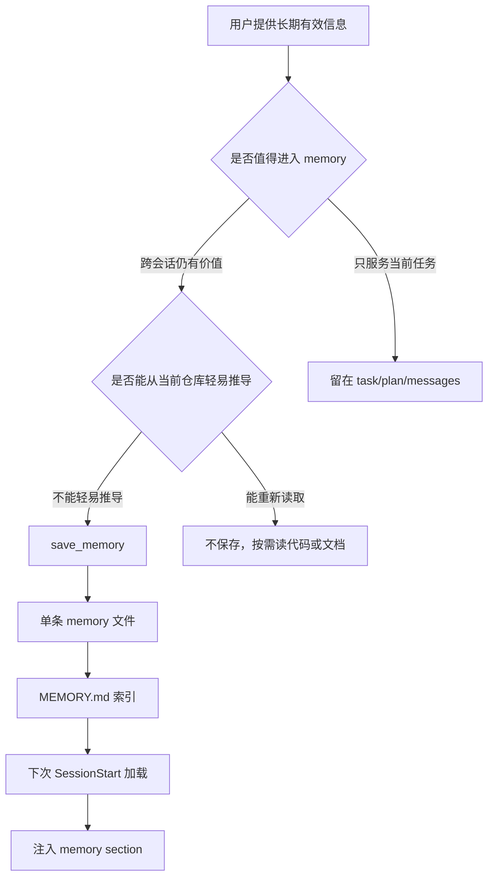
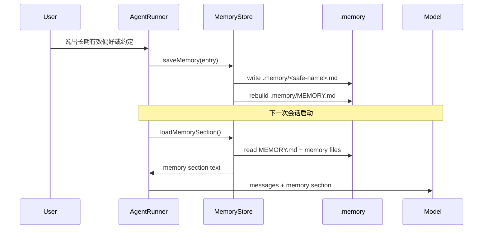

# s09 阶段开发文档：Memory 记忆系统

## 阶段目标

在 `s08` 已经把主循环扩展点拆出来之后，引入一个最小长期记忆层：

- 只保存跨会话仍然有价值的信息
- 只保存不能轻易从当前仓库状态重新推导的信息
- 每条 memory 独立落盘，便于阅读、删除和审查
- 会话启动时重新加载 memory，并把它作为一段补充上下文交给模型

这一阶段的核心不是“把所有有用信息都记下来”，而是：

**把长期记忆从当前对话、任务进度和代码事实里分离出来。**

## 核心概念



最小 Memory 系统只回答三件事：

1. 什么信息值得长期保存
2. 这条 memory 以什么格式落盘
3. 新会话开始时如何重新进入模型上下文

## 相对 s08 的变更

| 组件         | s08                           | s09                                    |
| ------------ | ----------------------------- | -------------------------------------- |
| 主循环扩展点 | `HookRunner` 观察生命周期事件 | `SessionStart` 可加载 memory section   |
| 新模块       | `HookRunner`                  | `MemoryStore`                          |
| 长期状态     | 无长期记忆                    | `.memory/` 文件目录 + `MEMORY.md` 索引 |
| 工具入口     | 工具执行前后 hook             | 新增最小 `save_memory` 工具            |
| 提示符       | `s08 >>`                      | `s09 >>`                               |

## 这一阶段不要做的事

- 不把 memory 做成当前任务进度系统
- 不保存密钥、密码、token 或凭证
- 不把文件结构、函数签名、目录布局写入 memory
- 不把 memory 当作当前真实状态的替代品
- 不提前实现复杂自动抽取、向量检索、团队共享作用域
- 不提前做 `s10 System Prompt` 的完整 prompt pipeline

当前阶段只做完成主体功能所需的最小边界：

- 四类 memory：`user` / `feedback` / `project` / `reference`
- 一个落盘目录：`.memory/`
- 一个索引文件：`.memory/MEMORY.md`
- 一个保存入口：`saveMemory()`
- 一个加载入口：`loadMemorySection()`
- 一个工具：`save_memory`

## 推荐的最小 Memory 模型

### Memory 类型

| 类型        | 保存什么                       | 示例                             |
| ----------- | ------------------------------ | -------------------------------- |
| `user`      | 用户长期偏好                   | 用户偏好中文、短答、少客套       |
| `feedback`  | 用户明确纠正过的工作方式       | 以后 review 先跑测试再下结论     |
| `project`   | 不容易从代码直接看出的项目约定 | 某个旧目录短期不能迁移是合规原因 |
| `reference` | 外部资源指针                   | 项目问题单通常在某个看板         |

### 不应进入 Memory 的信息

| 信息                         | 原因                         |
| ---------------------------- | ---------------------------- |
| 文件结构、函数路径、目录布局 | 可以重新读取当前仓库         |
| 当前任务进度、分支名、PR 号  | 很快过时，属于 task/plan/git |
| 修 bug 的具体代码细节        | 代码和提交记录才是准确信息   |
| 密钥、密码、凭证             | 安全风险                     |

## 最小执行顺序



## 需要新建的文件

1. **`src/core/memory-store.ts`**
   - 导出 `MemoryType`
   - 导出 `MemoryEntry`
   - 导出 `SavedMemory`
   - 导出 `MemoryStoreOptions`
   - 实现 `MemoryStore.saveMemory(entry)`
   - 实现 `MemoryStore.listMemories()`
   - 实现 `MemoryStore.loadMemorySection()`

2. **`tests/memory-store.test.ts`**
   - 覆盖保存单条 memory
   - 覆盖 `MEMORY.md` 索引重建
   - 覆盖非法类型拒绝
   - 覆盖 safe filename
   - 覆盖空目录加载返回空字符串

## 需要修改的文件

1. **`src/tools/builtin-tools.ts`**
   - 注册 `save_memory` 工具
   - 输入字段：`name` / `description` / `type` / `content`
   - 工具输出固定为 `Saved memory: <name> [<type>]`

2. **`src/core/agent-runner.ts`**
   - `AgentRunnerOptions` 接受可选 `memoryStore`
   - 会话开始时加载 memory section
   - 当前阶段可以把 memory section 作为一条用户侧 text message 注入
   - `s10` 再把它系统化为 prompt assembly pipeline 的一部分

3. **`src/cli/repl.ts`**
   - 创建默认 `MemoryStore`
   - 将 `.memory/` 放在 `workspaceRoot` 下
   - 提示符从 `s08` 更新为 `s09`

4. **`tests/agent-runner.test.ts`**
   - 覆盖会话开始时加载 memory section
   - 覆盖无 memoryStore 时保持 s08 行为

5. **`tests/repl-smoke.test.ts`**
   - 冒烟测试阶段提示从 `s08` 更新到 `s09`

## 推荐的文本格式约定

### 1. 单条 memory 文件

```markdown
---
name: prefer_chinese_short_answer
description: User prefers concise Chinese answers
type: user
---

The user prefers concise Chinese answers with direct actionable conclusions.
```

### 2. `.memory/MEMORY.md` 索引

```markdown
# Memory Index

- prefer_chinese_short_answer: User prefers concise Chinese answers [user]
- review_tests_first: Run tests before making review conclusions [feedback]
```

### 3. 注入给模型的 memory section

```text
<memory>
- prefer_chinese_short_answer [user]: User prefers concise Chinese answers
- review_tests_first [feedback]: Run tests before making review conclusions
</memory>
```

## 实现顺序

1. 实现 `MemoryType` / `MemoryEntry` / `MemoryStore`
2. 补 `tests/memory-store.test.ts`
3. 注册 `save_memory` 工具
4. 在 `AgentRunner` 会话开始时加载 memory section
5. 修改 `REPL` 默认装配和 `s09` 提示符
6. 验收：`npm run build` + `npm test`

## 需要用到的 Node.js 方法

| 功能     | Node.js 方法              | 用途                              |
| -------- | ------------------------- | --------------------------------- |
| 创建目录 | `fs.promises.mkdir()`     | 确保 `.memory/` 存在              |
| 写文件   | `fs.promises.writeFile()` | 保存单条 memory 和重建索引        |
| 读文件   | `fs.promises.readFile()`  | 加载 memory 文件内容              |
| 枚举目录 | `fs.promises.readdir()`   | 列出 `.memory/` 下的 memory 文件  |
| 拼接路径 | `path.join()`             | 构造 `.memory/<safe-name>.md`     |
| 解析路径 | `path.resolve()`          | 将 memory 目录定位到 workspace 内 |

## 阶段完成标准

满足下面条件，才算 `s09` 主体能力完成：

- `saveMemory()` 能把合法 memory 写成独立 Markdown 文件
- 保存 memory 后能重建 `.memory/MEMORY.md`
- `loadMemorySection()` 能返回稳定、可注入模型上下文的文本
- 非法 `type` 会被拒绝
- 文件名会被规范化，避免路径穿越
- 无 memory 时不会破坏 s08 主循环
- `save_memory` 工具不会保存密钥、当前任务状态或可从代码重新推导的信息

## 设计决策

- **Memory 不等于更长上下文**：compact 处理当前对话长度，memory 保存跨会话知识。
- **Memory 不等于任务系统**：任务进度属于后续 task system，不进入长期记忆。
- **Memory 不替代当前观察**：回答前仍应读取当前文件、配置和日志。
- **先用文件而不是数据库**：教学版优先可读、可删、可 diff。
- **先人工显式保存**：当前阶段不做自动抽取，避免 memory 污染。
